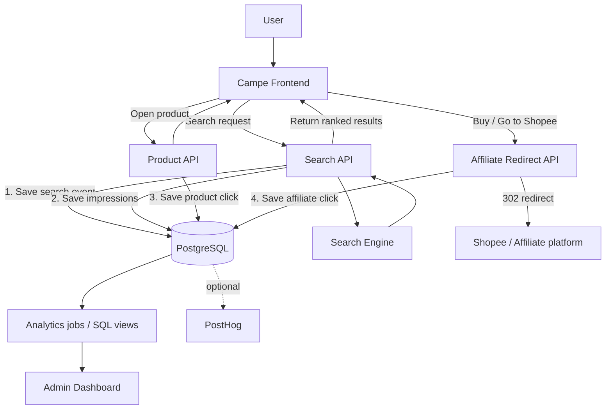
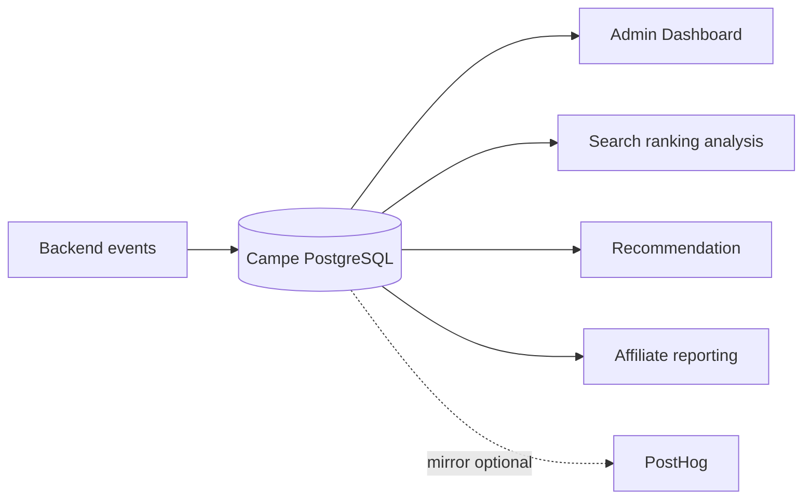
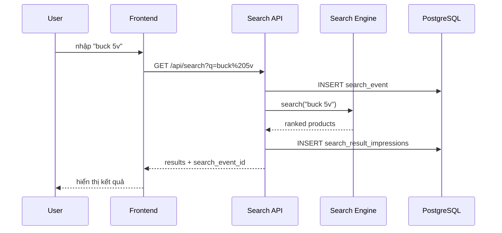
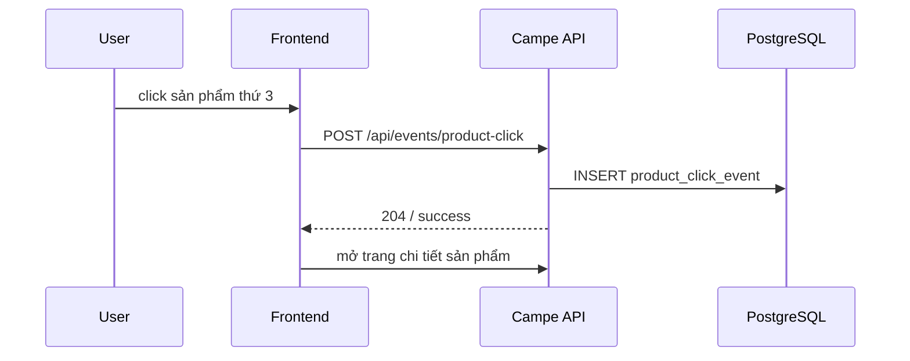
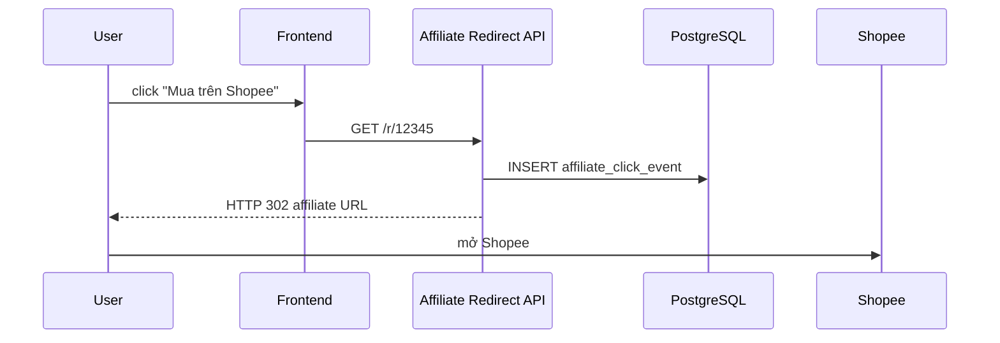
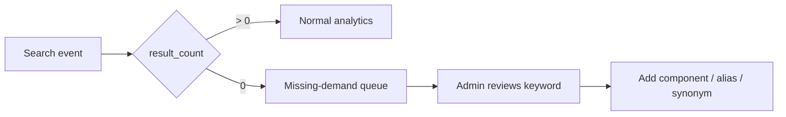

# Kiến trúc tracking của Campe

## 1. Mục tiêu

Campe cần tự sở hữu dữ liệu hành vi quan trọng để về sau có thể cải thiện tìm kiếm, xếp hạng linh kiện, recommendation, affiliate và phân tích nhu cầu thị trường.

Các dữ liệu bắt buộc phải lưu:

- mọi từ khóa người dùng tìm kiếm;
- số kết quả trả về;
- danh sách sản phẩm đã được hiển thị trong từng lần tìm kiếm;
- sản phẩm nào được click;
- vị trí của sản phẩm khi được click;
- click sang nền tảng affiliate;
- visitor/session/user tương ứng khi có thể xác định.

## 2. Sơ đồ tổng thể



## 3. Nguồn dữ liệu chuẩn



**PostgreSQL của Campe là source of truth.**

PostHog hoặc công cụ analytics khác chỉ dùng để:

- funnel;
- session analysis;
- biểu đồ;
- exploratory analytics.

Không được phụ thuộc hoàn toàn vào client-side analytics cho các số liệu kinh doanh chính.

## 4. Luồng một phiên tìm kiếm

Ví dụ người dùng tìm `buck 5v`:



Một `search_event_id` phải đại diện cho **một lần search thực tế**. Các impression và product click phát sinh từ search đó phải tham chiếu lại ID này.

## 5. Luồng click sản phẩm



Server cần biết tối thiểu:

- `search_event_id`;
- `product_id`;
- `position`;
- `visitor_id`;
- `session_id`;
- `user_id` nếu đã đăng nhập.

## 6. Luồng click affiliate

Không redirect trực tiếp từ frontend sang link Shopee nếu muốn tracking đáng tin cậy.

Dùng endpoint của Campe:

```text
/r/:listing_id
```

Luồng:



Endpoint redirect phải ghi event **trước khi trả 302**.

## 7. Định danh người dùng

Campe nên dùng ba mức ID:

```text
visitor_id   = trình duyệt / thiết bị ẩn danh
session_id   = một phiên truy cập
user_id      = tài khoản đã đăng nhập, nullable
```

Ví dụ:

```text
visitor_id = v_550e8400-e29b-41d4-a716-446655440000
session_id = s_8f42...
user_id    = 102     // chỉ có sau login
```

Sau khi login, không xóa lịch sử anonymous. Có thể liên kết `visitor_id` với `user_id` để phân tích hành trình trước và sau đăng nhập.

## 8. Quy tắc backend-first

Bắt buộc ghi ở backend:

1. `search_event` — vì request tìm kiếm chạy qua server.
2. `search_result_impression` — ghi ngay khi server quyết định kết quả nào được trả về.
3. `affiliate_click_event` — ghi trong redirect endpoint.

`product_click_event` có thể được frontend gửi sang backend vì click xảy ra trong trình duyệt, nhưng backend mới là nơi xác thực và lưu event.

## 9. Không bỏ sót từ khóa

Search log phải lưu hai trường:

```text
query_raw        = chuỗi user nhập nguyên bản
query_normalized = chuỗi dùng cho search/index
```

Ví dụ:

```text
query_raw        = "Mạch Hạ Áp LM 2596  "
query_normalized = "mach ha ap lm2596"
```

Không bao giờ chỉ lưu `query_normalized`, vì dữ liệu raw dùng để hiểu cách người Việt thật sự tìm linh kiện.

## 10. Zero-result search

`result_count = 0` không phải lỗi tracking. Đây là dữ liệu ưu tiên cao.



Dashboard cần có riêng bảng **Top từ khóa không có kết quả**.
