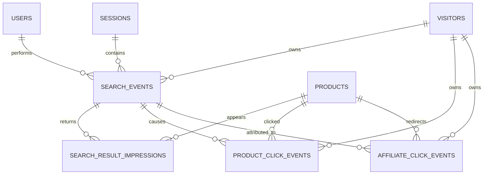

# PostgreSQL schema đề xuất cho tracking

> Đây là schema logic. Codex phải điều chỉnh kiểu khóa ngoại theo schema sản phẩm/user thực tế của repo khi phần backend được tạo.

## 1. ERD



## 2. search_events

```sql
CREATE TABLE search_events (
    id UUID PRIMARY KEY,
    visitor_id UUID NOT NULL,
    session_id UUID NOT NULL,
    user_id BIGINT NULL,

    query_raw TEXT NOT NULL,
    query_normalized TEXT NOT NULL,

    result_count INTEGER NOT NULL CHECK (result_count >= 0),
    page INTEGER NOT NULL DEFAULT 1 CHECK (page >= 1),
    page_size INTEGER NOT NULL CHECK (page_size > 0),

    is_bot BOOLEAN NOT NULL DEFAULT FALSE,
    is_internal BOOLEAN NOT NULL DEFAULT FALSE,
    risk_score REAL NULL,

    created_at TIMESTAMPTZ NOT NULL DEFAULT NOW()
);

CREATE INDEX idx_search_events_created_at
    ON search_events (created_at DESC);

CREATE INDEX idx_search_events_query_normalized
    ON search_events (query_normalized);

CREATE INDEX idx_search_events_zero_results
    ON search_events (created_at DESC)
    WHERE result_count = 0;

CREATE INDEX idx_search_events_user_id
    ON search_events (user_id, created_at DESC)
    WHERE user_id IS NOT NULL;
```

## 3. search_result_impressions

```sql
CREATE TABLE search_result_impressions (
    id BIGSERIAL PRIMARY KEY,
    search_event_id UUID NOT NULL REFERENCES search_events(id) ON DELETE CASCADE,
    product_id BIGINT NOT NULL,
    position INTEGER NOT NULL CHECK (position >= 1),
    page INTEGER NOT NULL DEFAULT 1 CHECK (page >= 1),
    ranking_score DOUBLE PRECISION NULL,
    created_at TIMESTAMPTZ NOT NULL DEFAULT NOW(),

    UNIQUE (search_event_id, product_id, position)
);

CREATE INDEX idx_impressions_product
    ON search_result_impressions (product_id, created_at DESC);

CREATE INDEX idx_impressions_search
    ON search_result_impressions (search_event_id, position);
```

## 4. product_click_events

```sql
CREATE TABLE product_click_events (
    id BIGSERIAL PRIMARY KEY,
    event_id UUID NOT NULL UNIQUE,

    visitor_id UUID NOT NULL,
    session_id UUID NOT NULL,
    user_id BIGINT NULL,

    search_event_id UUID NULL REFERENCES search_events(id) ON DELETE SET NULL,
    product_id BIGINT NOT NULL,
    position INTEGER NULL CHECK (position IS NULL OR position >= 1),
    surface TEXT NOT NULL,

    is_bot BOOLEAN NOT NULL DEFAULT FALSE,
    is_internal BOOLEAN NOT NULL DEFAULT FALSE,
    risk_score REAL NULL,

    created_at TIMESTAMPTZ NOT NULL DEFAULT NOW()
);

CREATE INDEX idx_product_clicks_product
    ON product_click_events (product_id, created_at DESC);

CREATE INDEX idx_product_clicks_search
    ON product_click_events (search_event_id)
    WHERE search_event_id IS NOT NULL;
```

## 5. affiliate_click_events

```sql
CREATE TABLE affiliate_click_events (
    id BIGSERIAL PRIMARY KEY,
    event_id UUID NOT NULL UNIQUE,

    visitor_id UUID NOT NULL,
    session_id UUID NOT NULL,
    user_id BIGINT NULL,

    search_event_id UUID NULL REFERENCES search_events(id) ON DELETE SET NULL,
    product_id BIGINT NOT NULL,
    listing_id BIGINT NOT NULL,
    seller_id BIGINT NULL,

    platform TEXT NOT NULL,
    affiliate_sub_id TEXT NULL,
    source_surface TEXT NOT NULL,

    is_bot BOOLEAN NOT NULL DEFAULT FALSE,
    is_internal BOOLEAN NOT NULL DEFAULT FALSE,
    risk_score REAL NULL,

    created_at TIMESTAMPTZ NOT NULL DEFAULT NOW()
);

CREATE INDEX idx_affiliate_clicks_product
    ON affiliate_click_events (product_id, created_at DESC);

CREATE INDEX idx_affiliate_clicks_listing
    ON affiliate_click_events (listing_id, created_at DESC);

CREATE INDEX idx_affiliate_clicks_user
    ON affiliate_click_events (user_id, created_at DESC)
    WHERE user_id IS NOT NULL;
```

## 6. visitor_sessions tối thiểu

Nếu hệ thống chưa có bảng session analytics, có thể thêm:

```sql
CREATE TABLE visitors (
    id UUID PRIMARY KEY,
    first_seen_at TIMESTAMPTZ NOT NULL DEFAULT NOW(),
    last_seen_at TIMESTAMPTZ NOT NULL DEFAULT NOW()
);

CREATE TABLE visitor_sessions (
    id UUID PRIMARY KEY,
    visitor_id UUID NOT NULL REFERENCES visitors(id),
    user_id BIGINT NULL,
    started_at TIMESTAMPTZ NOT NULL DEFAULT NOW(),
    last_seen_at TIMESTAMPTZ NOT NULL DEFAULT NOW()
);
```

## 7. Không lưu counter duy nhất trên product

Không nên chỉ có:

```text
products.click_count += 1
```

vì sẽ mất dữ liệu nguồn và không thể biết click đến từ đâu.

Nên giữ event log làm nguồn chuẩn rồi tạo bảng aggregate/materialized view nếu cần tốc độ.

Ví dụ:

```sql
SELECT
    product_id,
    COUNT(*) AS clicks
FROM product_click_events
WHERE is_bot = FALSE
  AND is_internal = FALSE
GROUP BY product_id;
```

## 8. Aggregate khi traffic lớn

Khi dữ liệu tăng, tạo bảng theo ngày:

```text
product_daily_metrics
---------------------
date
product_id
impressions
product_clicks
affiliate_clicks
unique_visitors
```

Nhưng **không xóa raw events** chỉ vì đã có aggregate, trừ khi có retention policy rõ ràng.

## 9. Transaction boundary cho search

Khuyến nghị:

1. tạo `search_event_id`;
2. chạy search;
3. cập nhật `result_count`;
4. insert impressions bằng batch;
5. trả kết quả kèm `search_event_id`.

Nếu search engine lỗi, có thể lưu trạng thái lỗi riêng thay vì giả `result_count = 0`. Zero-result và search-error là hai trường hợp khác nhau.

## 10. Tính toàn vẹn dữ liệu

Codex cần đảm bảo:

- Không cho client tự quyết định `user_id`; lấy từ auth context backend.
- Không cho client gửi `created_at` làm thời gian chuẩn.
- Kiểm tra `product_id`/`listing_id` tồn tại hoặc được phép redirect.
- `search_event_id` khi gửi product click phải thuộc session/visitor phù hợp nếu triển khai validation chặt.
- Affiliate URL phải được lấy từ dữ liệu server, không nhận URL tùy ý từ client để tránh open redirect.
