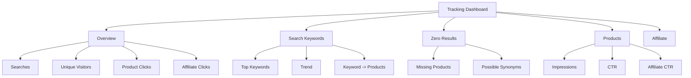

# Dashboard metrics cho Campe

## 1. Search volume

```sql
SELECT DATE(created_at) AS day, COUNT(*) AS searches
FROM search_events
WHERE is_bot = FALSE AND is_internal = FALSE
GROUP BY DATE(created_at)
ORDER BY day DESC;
```

## 2. Top từ khóa

```sql
SELECT
    query_normalized,
    COUNT(*) AS search_count,
    COUNT(DISTINCT visitor_id) AS unique_visitors,
    AVG(result_count) AS avg_result_count
FROM search_events
WHERE is_bot = FALSE AND is_internal = FALSE
GROUP BY query_normalized
ORDER BY search_count DESC
LIMIT 100;
```

## 3. Top zero-result keywords

```sql
SELECT
    query_normalized,
    COUNT(*) AS search_count,
    COUNT(DISTINCT visitor_id) AS unique_visitors
FROM search_events
WHERE result_count = 0
  AND is_bot = FALSE
  AND is_internal = FALSE
GROUP BY query_normalized
ORDER BY search_count DESC
LIMIT 100;
```

Đây là danh sách ưu tiên để:

- thêm linh kiện còn thiếu;
- thêm alias/synonym;
- sửa thuật toán search;
- phát hiện nhu cầu mới.

## 4. Product CTR

```sql
WITH imp AS (
    SELECT product_id, COUNT(*) AS impressions
    FROM search_result_impressions
    GROUP BY product_id
), clk AS (
    SELECT product_id, COUNT(*) AS clicks
    FROM product_click_events
    WHERE is_bot = FALSE AND is_internal = FALSE
    GROUP BY product_id
)
SELECT
    imp.product_id,
    imp.impressions,
    COALESCE(clk.clicks, 0) AS clicks,
    ROUND(
        COALESCE(clk.clicks, 0)::numeric / NULLIF(imp.impressions, 0) * 100,
        2
    ) AS ctr_percent
FROM imp
LEFT JOIN clk USING (product_id)
ORDER BY impressions DESC;
```

## 5. Affiliate CTR

Hai tỷ lệ nên xem riêng:

```text
Search CTR      = product_clicks / impressions
Affiliate CTR   = affiliate_clicks / product_clicks
```

Điều này giúp phân biệt:

- sản phẩm không hấp dẫn ngay từ search result;
- sản phẩm được xem nhiều nhưng không khiến user sang Shopee.

## 6. Keyword → product clicks

```sql
SELECT
    s.query_normalized,
    c.product_id,
    COUNT(*) AS clicks
FROM product_click_events c
JOIN search_events s ON s.id = c.search_event_id
WHERE c.is_bot = FALSE
  AND c.is_internal = FALSE
GROUP BY s.query_normalized, c.product_id
ORDER BY clicks DESC;
```

Dữ liệu này cực kỳ quan trọng cho ranking sau này.

Ví dụ:

```text
query: buck 5v

LM2596   1,420 clicks
XL4015     821 clicks
MP1584     701 clicks
```

Search engine có thể dùng dữ liệu aggregate này như một tín hiệu ranking, nhưng không nên dùng click count đơn lẻ làm ranking duy nhất.

## 7. Dashboard layout gợi ý



## 8. Các metric MVP

Dashboard phiên bản đầu chỉ cần:

```text
searches_today
unique_visitors_today
zero_result_searches_today
product_clicks_today
affiliate_clicks_today
```

Bảng search:

```text
keyword
search_count
unique_visitors
result_count_avg
zero_result_rate
product_clicks
search_ctr
```

Bảng product:

```text
product
impressions
product_clicks
search_ctr
affiliate_clicks
affiliate_ctr
```

## 9. Không chỉ nhìn tổng click

Ví dụ:

```text
Product A
100,000 impressions
5,000 clicks
CTR = 5%

Product B
10,000 impressions
2,500 clicks
CTR = 25%
```

Nếu chỉ xem total click thì Product A thắng, nhưng Product B có thể phù hợp với search intent hơn nhiều.

Vì vậy luôn lưu impression trước khi bắt đầu tối ưu ranking bằng click data.

## 10. Metrics nên thêm về sau

- CTR theo ranking position;
- zero-result rate theo category;
- keyword trend 7d/30d;
- repeat searches trong cùng session;
- query reformulation: `buck 5v` → `lm2596 5v`;
- search-to-affiliate conversion;
- click distribution theo seller/listing;
- time từ search đến affiliate click;
- recommendation CTR;
- compare-product usage;
- data quality/anomaly reports.
